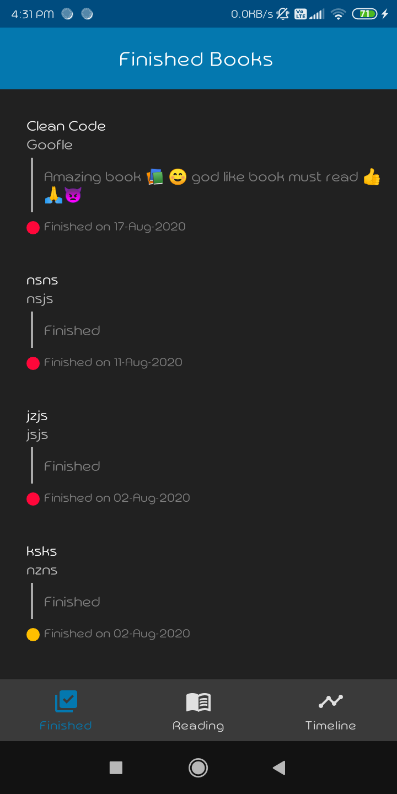

# Android - Book Read Tracker

Android applicaiton to track and monitor the books you are currently reading or finished 
Based on modern Android application tech-stacks and MVVM architecture.

### Tech stack & Open-source libraries
- Minimum SDK level 21
- [Kotlin](https://kotlinlang.org/) based, Used [Coroutines](https://github.com/Kotlin/kotlinx.coroutines)
- Dagger-Hilt (alpha) for dependency injection.
- JetPack
  - [LiveData](https://developer.android.com/topic/libraries/architecture/livedata) - notify domain layer data to views.
  - [ViewModel](https://developer.android.com/topic/libraries/architecture/viewmodel) - UI related data holder, lifecycle aware.
  - [Room](https://developer.android.com/training/data-storage/room) - constructing database.
- Architecture
  - MVVM Architecture
  - Repository pattern
- [Navigation](https://developer.android.com/guide/navigation)
- [Material-Components](https://github.com/material-components/material-components-android)
- [MPAndroidChart](https://github.com/PhilJay/MPAndroidChart)
- [Material Dialog](https://github.com/afollestad/material-dialogs)
- [ThreeTenABP](https://github.com/JakeWharton/ThreeTenABP)

### Architecture
App is based on MVVM architecture and a repository pattern.

### Screenshots
      

    
 

